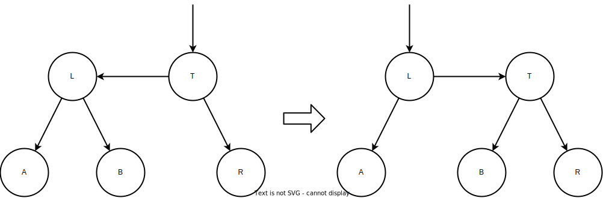
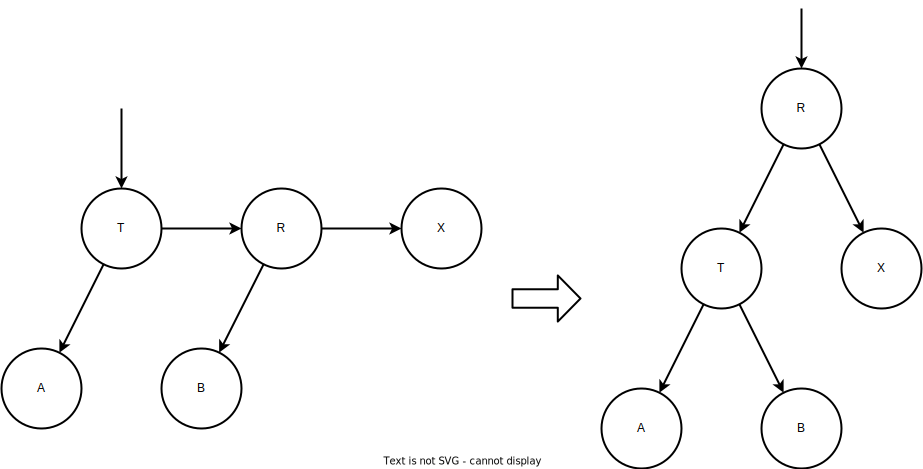

# aa_tree

AA木の実装

## アルゴリズム

AA木は各ノードに**レベル**という値を持ち，それぞれのノードは以下の条件を満たす．

1. 葉ノードのレベルは $1$ である
2. 左の子ノードのレベルは親ノードのレベルより必ず $1$ つ小さい
3. 右の子ノードのレベルは親ノードのレベルと等しいか $1$ つ小さい
4. 右の孫ノードのレベルは祖父（祖母）ノードのレベルより必ず小さい
5. レベルが $1$ より大きいノードは，必ず $2$ つの子ノードをもつ

（[wikipedia](https://ja.wikipedia.org/wiki/AA%E6%9C%A8#%E5%B9%B3%E8%A1%A1%E5%9B%9E%E8%BB%A2)より）

### skew

### split

## 参考

- [AA木 - wikiedia](https://ja.wikipedia.org/wiki/AA%E6%9C%A8)
