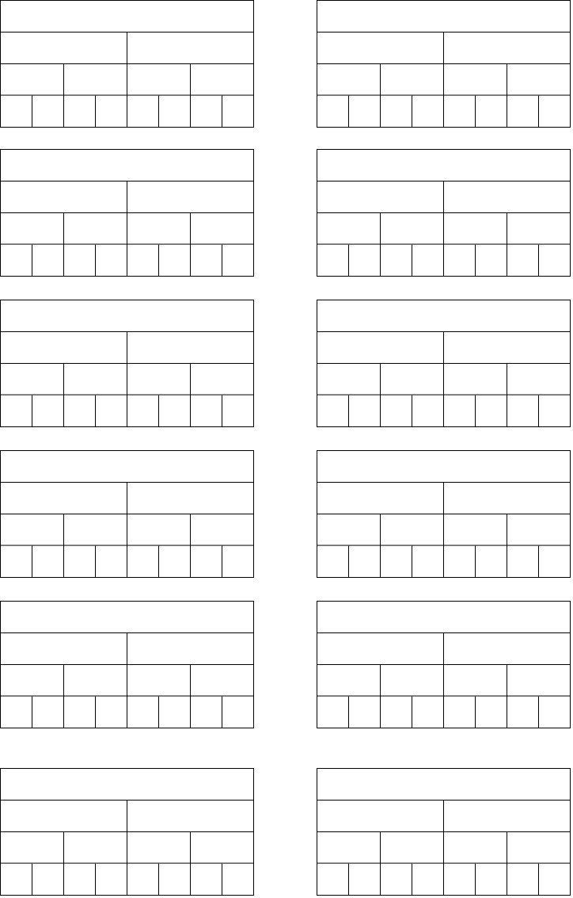

# Lazy Segment Tree

- 遅延セグメント木の実装

## 要件

### `lazy_segment_tree_primitive.rs`

最も簡易な遅延セグメント木

- 再帰実装
- データ型は`isize`
- 演算は
  - 区間加算
  - 区間取得
- 可環な演算に対応した処理

### `lazy_segment_tree.rs`

抽象化された遅延セグメント木

### `alg.rs`

作用付きモノイドを表すトレイトを実装する

## 可視化

